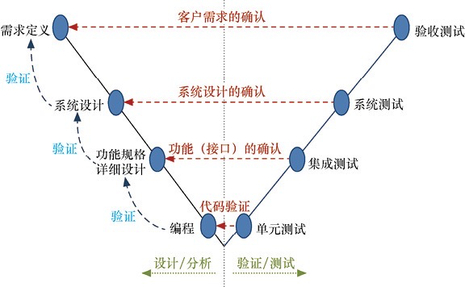
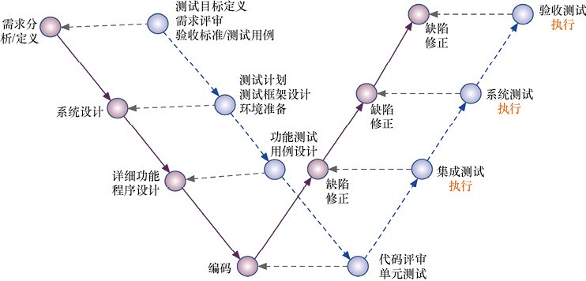
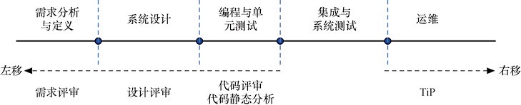
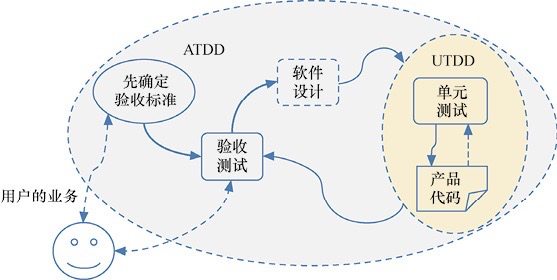
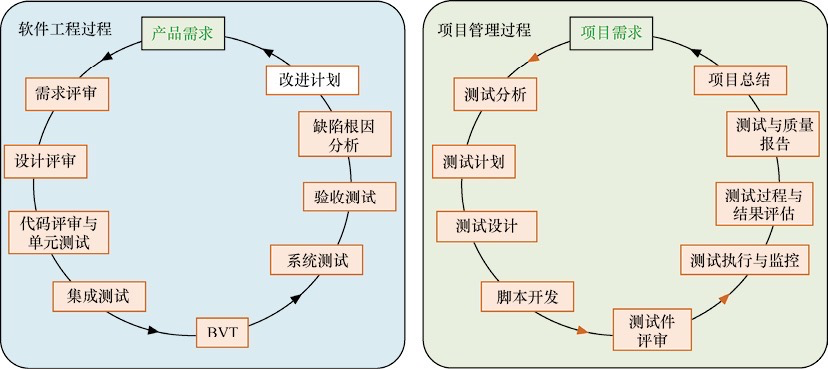
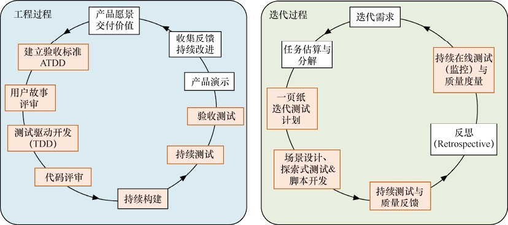
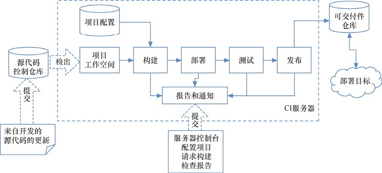
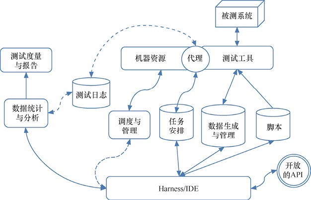

# 《全程软件测试》读书笔记

## 1. 软件测试的概念

### 1. 正反思维

软件测试就是一系列活动，这些活动是为了评估一个程序或软件系统的特性或能力，并确定其是否达到了预期结果。

但同时，由于无法穷尽测试的特性，逆向思维方式可以提升测试效率。

为了做好测试，既要有深度，又要有广度；既要有效率，又要有测试工作自身完整的质量。所以，我们应该将正向思维和逆向思维有机地结合起来，做到效率和质量的平衡。

### 2. 狭义测试到广义测试

狭义的软件测试：动态测试——运行程序而进行的测试，测试只是编程之后的阶段，这也是由传统的瀑布模型而决定的。
广义的软件测试：动态测试+静态测试，将需求评审、设计评审、代码评审（含代码的静态分析）等也纳入软件测试工作之中。这也使“软件测试”不再停留在编程之后的某个阶段上，而成为贯穿整个软件研发周期的质量保证活动，这也是本书“全程软件测试”的最早立意所在。

### 3. 基于质量的认知

基于质量的认识，软件测试就是对软件产品的质量评估，提高软件产品有关的质量信息。

### 4. 基于风险的认知

强调集成测试。

### 5. 基于社会性的认知

### 6. 基于经济的认知

### 7. 基于标准的认知

- 单元测试是对软件基本组成单元进行的测试，其测试对象是软件设计的最小单位——模块或组件，也可以包括类或函数。软件单元具有独立性，可以将它与系统/程序的其他部分隔离出来，从而完成测试。单元测试也是软件测试过程中最早期的测试活动，是软件的基础测试。
- 集成测试是将已分别通过测试的单元按设计要求组合起来再进行的测试，以检查这些单元之间的接口是否存在问题。集成测试一般是一个逐渐加入单元进行测试的持续过程，直至所有单元被组合在一起，成功地构成完整的软件系统，从而完成集成测试的使命。
- 系统测试是充分运行或模拟运行软件系统，以验证系统是否满足产品的质量需求。系统测试包含系统功能测试和系统非功能性测试，系统非功能性测试主要是指系统性能测试、容量测试、安全性测试、兼容性测试和可靠性测试等。系统功能测试和非功能性测试可以并行实施，但一般在基本功能已能正常运行后，才进行系统性能测试、兼容性测试、可靠性测试等。
- 验收测试是在软件产品完成了系统测试之后、产品发布之前所进行的软件测试活动。它是技术测试的最后一个阶段，也称为交付测试。验收测试一般会根据产品规格说明书或用户故事等各种需求定义，严格地、逐项检查产品，确保所开发的软件产品符合用户预期的各项要求，即验收测试是检验产品和产品规格说明书（包括软件开发的技术合同）的一致性，同时考虑用户的实际使用环境、数据和习惯等。验收测试的重要特征就是用户参与，或用户代表（如产品经理、Product Owner）参与。
回归测试是由于软件修改或变更，对修改后的工作版本所有可能影响的范围进行测试。回归测试的目的是发现原来正常的功能特性出现新的问题——回归缺陷，从而确保原来正常的或符合要求的特性不受其他区域修改的影响。回归测试伴随着整个测试过程，在功能测试和系统测试、单元测试和集成测试中，一旦有变更或修正，都要进行相应的回归测试。

- 软件研发的 V 模型

### 8. 基于Test Oracle的认知

测试 = 检测已知的 + 试验未知的

### 9. 基于批判性思维的认知

### 10. 基于传统开发模式的认知

- 传统 W模型

### 11. 基于敏捷开发模式的认知

## 2. 全程测试

### 1. 测试左移与右移

### 2. 测试驱动开发

- UTDD
- ATDD

### 3. 传统研发模式的测试环

### 4. 敏捷研发中的测试环

### 5. DevOps 与测试

## 3. 基础设施与TA框架

### 1. 虚拟机与容器技术

### 2. 基础设施即代码

### 3. 持续集成环境

### 4. 自动化测试框架

- 构成与分类
- 单元测试框架
- UI TA 框架
- 移动应用 TA 框架
- 面向 API 的 TA 测试框架

### 5. DevOps 完整工具链

## 4. 个体与团队

## 5. 项目启动

### 1. 用户与质量要求

ISO 29119就是国际软件测试标准

### 2. 项目背景

做好软件测试，自然需要清楚项目的背景，特别要抓住与软件测试相关的项目要素，如项目的目标、交付物、质量要求、范围、进度、可用的资源、（开发）团队、开发环境、相关利益者等，获取、分析和综合理解与这些要素相关的详细信息。

### 3. 产品元素

### 4. 测试方法与技术

### 5. 确定测试规范

## 6. 测试计划：分析与策略

### 1. 目标

### 2. 项目需求

### 3. 工作量估算

### 4. 资源需求

### 5. 里程碑与进度安排

### 6. 风险分析

### 7. 制定有效策略

### 8. 编写测试计划书

## 7. 测试设计：架构与用例

### 1. 框架设计

### 2. 要考虑的因素

### 3. 运行测试设计方法

### 4. 非功能性测试也存在设计

### 5. 探索式测试之设计

### 6. 测试用例规范性与评审

### 7. 测试集创建

## 8. 测试执行：自动与探索

### 1. 测试执行概述

### 2. 测试执行的准备

### 3. 如何有效创建测试集

### 4. 敏捷测试执行

### 5. 用户体验和易用性测试

### 6. 回归测试

### 7. 软件缺陷的报告

## 9.持续反馈与改进

### 1. 验收测试

### 2. 部署验证

### 3. 在线测试与日志分析

### 4. 后继版本测试

### 5. 测试过程评审

### 6. 团队反思：持续改进

## 10. 全程静态测试

### 1. 常用评审方法

### 2. 需求评审优秀实践

### 3. 系统架构审查

### 4. 产品设计规格说明书的复查

### 5. 系统部署设计的审查

### 6. 代码评审与静态分析

## 11. 全程性能测试

### 1. 常见性能问题

### 2. 确定系统性能需求

### 3. 性能测试设计

### 4. 执行性能测试

### 5. 分析与评估测试结果

## 12. 全程安全性

### 1. 贯穿生命周期的安全测试

### 2. 滥用案例与安全性需求

### 3. 安全性风险分析

### 4. 安全性静态测试

### 5. 渗透测试

### 6. 系统运维安全性监控与审计

## 13. 全程建模：彻底自动化

### 1. 测试过程模型

### 2. 基于模型的测试

### 3. 基于业务建模的 MBT 方法

### 4. 基于 UML 的 MBT 方法

## 14. 全程可视化

### 1. 测试过程的度量体系

### 2. 测试全过程的建模

### 3. 测试度量管理与工具

### 4. 测试用例管理

### 5. 测试管理工具的应用

## 15. 展望

### 1. 云计算与测试的基础设施

### 2. 微服务、契约测试与自动化测试

### 3. 如何测试人工智能软件

### 4. 如何用 AI 技术为测试服务
